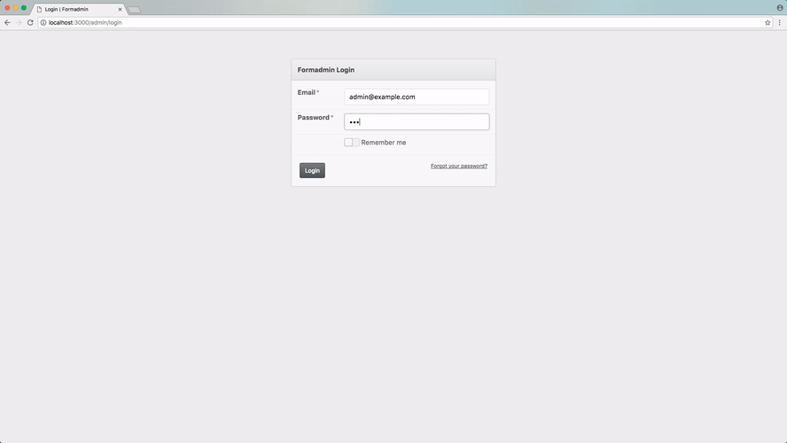

# Formadmin

Modern and responsive theme for Active Admin used by Formaweb.


## Installation

Please make sure that you are using Active Admin:

```ruby
gem 'activeadmin'
```

Add this gem in your `Gemfile`:

```ruby
gem 'formadmin'
```

So, bundle...

```console
$ bundle install
```

## Usage

All you have to do is change your `assets/stylesheets/active_admin.scss`:

**Remove** the loading defaults...

```sass
@import 'active_admin/mixins';
@import 'active_admin/base';
```

**Replace** with Formadmin:

```sass
@import 'formadmin/formadmin';
```

### Overriding colors

You can override the default colors (as defined in `app/assets/stylesheets/formadmin/core/_settings.scss`) by setting the color variable in your `assets/stylesheets/active_admin.scss` before `formadmin` is loaded.

For example, to change the primary color, use:

```sass
$primary-color: #c0ffee;
@import 'formadmin/formadmin';
```

## Video



## Donating

- **Bitcoin (BTC):** 1QDoa2Cr8Lbt15mSDQwQc1vRxH9HHT8AC
- **Ethereum (ETH)**: 0x9d55a96d00B70FF9c23B05D610261E61e398f5BF
- **Litecoin (LTC):** LVu6cTKF1VDVVFBxQPKpRUmbcshEeeWy8H

## Contributing

1. Fork it ( https://github.com/formaweb/formadmin/fork )
2. Create your feature branch (`git checkout -b my-new-feature`)
3. Commit your changes (`git commit -am "Add some feature"`)
4. Push to the branch (`git push origin my-new-feature`)
5. Create a new Pull Request

### Testing

All you need to do is set the local path on your project `Gemfile`, like this:

```ruby
gem 'formadmin', path: '/path/to/formadmin'
```
